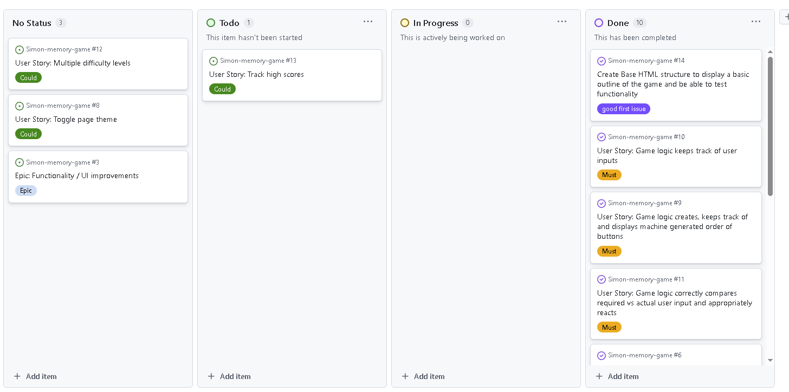
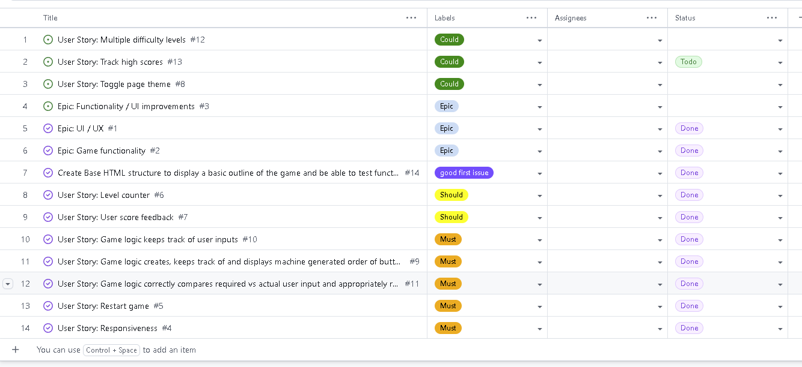
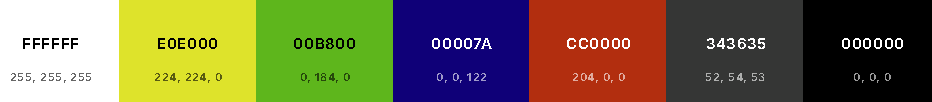
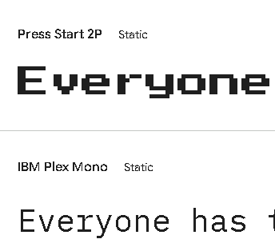
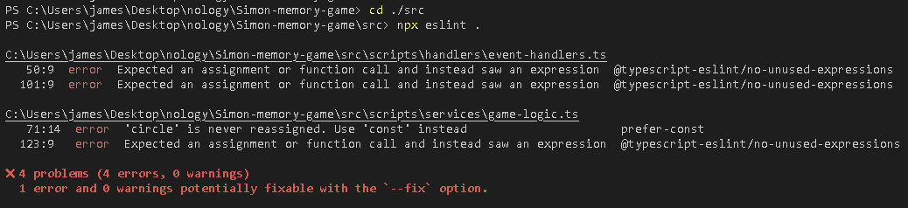
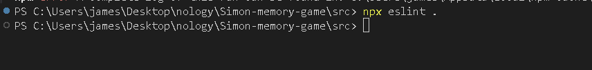

# Simon memory game

## [ --> View the live deployed project here <-- ](https://jamesbracken.github.io/Simon-memory-game/)

## UIX

### Strategy

#### Project overview

Welcome to my reinvented verrsion of the simon memory game. This main target demographic would be younger individuals, childrens and teens who would like to have a bit of a challenge and enhance their memory skills. The game is fun, intuitive, user friendly and fully responsive.

### Scope

Planning of my project was made using **Epics** at the highest level and then **User stories** as sub issues to the epic. Using User Stories we were able to place ourselves in the shoes of our end users so we can better plan our project. You can find the project board view and the backlog [HERE](https://github.com/users/JamesBracken/projects/18/views/1).

#### Agile methodology

This project followed an agile methodology approach to ensure we have an MVP by the project deadline and remained within scope. The project was developed in an iterative manner, being developed one component at a time. By using the Agile methodology we were able to get our MVP and more, we completed all Must and Should have user stories at present and can potentially still implement could have user stories.

**Moscow prioritisation**

To aid in getting to an MVP and remaining in project scope we used the moscow method. We organised our user stories by how important it would be to reaching an MVP, we listed them as **Must, Should, Could and Wont**. By organising each user story with a factor of importance, we were better able to direct our resources towards the most important components of the project labelled Must. Any user story labelled Should and Could was focues on later in the project only if within scope.

Project Board

Project Backlog

### Skeleton

**Wireframes**

A low-medium fidelity wireframe was made with [Figma](https://www.figma.com/). There is a representation for the game at each major breakpoint of 320px, 576px, 768px and 992px. By creating wireframes we were able to better plan the needed user stories and ease development as we know exactly what we want. There are some components which do not exactly match the final product, some components might look slightly different due to scope or changes of plan.

- [All pages](https://www.figma.com/design/SRSHu99Ow1RqFNh0B0Dld7/Nology-Wireframes?node-id=0-1&t=l1ev8iwxyY14MFOm-1)

### Surface

#### Colour scheme

The colour scheme of our final product is a representation of the original simon game. We used [Coolors](https://coolors.co/ffffff-e0e000-00b800-00007a-cc0000-343635-000000) to create our color palette and used shades of these colors for game UI effects.

As there is already many colors in the game circles I decided to go with a simple background theme. I decided to use an Onyx background theme to aid users in being able to focus on the indicated circles.

Color palette

#### Typography

We used [google fonts](https://fonts.google.com/) to add the chosen fonts for 
our website. The fonts we used are a throwback to arcade themes which had very simillar kinds of simplistic old fashion games.

**Headings** - We used Press Start 2P for our headings to stand out as it has a higher font weight than most fonts and gives that arcade style look that we are going for.

**Body text** - We used IBM Plex Mono as it is a simple font and complements the headers that we have chosen.

Chosen google fonts

### Structure

#### Page/code structure

To make our code structured and readable we use semantic HTMl, comments, docstrings and indentation. Our game is separated by placing the main game in the main and the UI components within the header.

#### Folder organisation(SASS, TS)

To make our code more readable, undestandable and maintainable we have separated and segregated code according to convention. Our SCSS code follows the **7-1 architecture** and to aid this we use **BEM** naming convention for all of our classes. There is no specific convention for how to organise typescript code as it varies by team, I implemented the below folder structure which met my project needs while also separating and organising my typescript code well.

## Testing

Through research I found that typescript doesnt cover all the bases of making sure that code is clean and flawless. I installed ESlint for some additional typescript testing to improve my typescript code and point out any unspotted mistakes.

My initial ESlint testing came up with minimal errors which were all fixed. 
ESlint initial test

ESlint final test

## Deployment

### Github guide

As this github repository is public anyone who would like to work on this repo can do so by following the below steps 

**Cloning**
To clone a repository follow these steps

1. Login in to Github or create an account if you haven't already

2. Go to this project repository [Simon memory game](https://github.com/JamesBracken/Simon-memory-game))

3. Click on the *Code* button and select whether you would like to cline with HTTPS, SSH or the Github CLI and then copy the link shown

4. Open your terminal in your IDE/code editor of choice then change the current working directory to the location you would like to use for the cloned directory

5. Type "git clone" into the terminal and paste the link you copied in the third step then press Enter

6. To install the dependencies you can run **npm install** in your IDE(integrated development environment) terminal, the dependencies you need are listed in the package.json and package-lock.json files

**Commiting and Pushing Changes**

1. Open the terminal in the directory of your cloned repository

2. Using "git status" check to see your changes are correct

3. If you are ready to commit  type "git add ." to stage all saved changes to be commited, you can alternatively use "git add YOUR_FILENAME" to stage specific files for commit

4. Using "git commit -m "Write your commit message here" commit your changes with a descriptive message, give a good amount of detail but try not to go over 50 characters

5. Finally use "git push origin main" to push your changes to the main branch of your github repository

**Forking**

To fork this repository follow these steps

1. Setup Git and make sure your git has github authentication

2. Go to the web page repository [Simon memory game](https://github.com/JamesBracken/Simon-memory-game) 

3. Click on *fork* on the upper right portion of the page.

4. This has now forked the repository to your own profile. 

5. Go to your profile and navigate to the forked repository.

6. Click on *Code* above the list of forked files

7. Choose the option you need from the dropdown menu. 

Further assistance can be found [HERE](https://docs.github.com/en/pull-requests/collaborating-with-pull-requests/working-with-forks/fork-a-repo) on the github Fork a Repo page

**Local development**

1. Clone your repository from Github, you can find the "Code" button where you can copy the url from

2. Open your IDE and open a terminal, make sure you are in the correct directory where you want to clone the repository to.

3. Type git clone URL, replace URL with the one you just copied in the first step

## Credits

### Technologies

1. [Javascript](https://en.wikipedia.org/wiki/JavaScript) - Javascript is a scripting language used add in dynamic content in web browsers

2. [Typescript](https://en.wikipedia.org/wiki/TypeScript) - A superset of Javascript adding in type safety and other useful features to the language

3. [SASS](https://sass-lang.com/) - A stable powerful CSS framework which assists in creating more organised structured CSS

4. [HTML](https://en.wikipedia.org/wiki/HTML) - Hyper Text Markup Language, this is the skeleton and base of any webpage

5. [VSCode](https://code.visualstudio.com/) - The most widely used IDE across the planet, we use vs code as our integrated development environment.

6. [Github](https://github.com/) - A platform for displaying code, version control and a system for multiple developers to collaborate on the same codebase

7. [Vite](https://vite.dev/) - Handles bundling, gives base templates and other tools to aid and ease the building of projects

8. [ChatGPT](https://openai.com/index/chatgpt/) - AI used to aid development

9. [Google fonts](https://fonts.google.com/) -  Generates fonts for the project

10. [Figma](https://www.figma.com/) -  An application used to make wireframe drawings

11. [Bootstrap](https://getbootstrap.com/) - Used to aid in development of responsiveness and inline styling

12. [Github desktop](https://desktop.github.com/download/) - An app used to ease version control. 

### Code and resources used

1. [SASS 7-1 architecture article](https://medium.com/@diyorbekjuraev77/be-a-master-at-creating-the-7-1-sass-pattern-776fdfb5a3b1) - This article gives a good explanation into how to structure your SASS

2. [Vite & typescript projoect github deployment guide ](https://www.youtube.com/watch?v=Y3yCB7CfjF4) -  I used this video tutorial as a guide to how to deploy my project to github using github actions 

3. [Sass docs](https://sass-lang.com/) - Great documentation to aid in development of SCSS code 

### Acknowledgements

A big thankyou to [nology](https://nology.io/) for giving me tools and training to make this project possible and to [Remi Hoeppe](https://github.com/remihoeppe) for training, support and feedback.